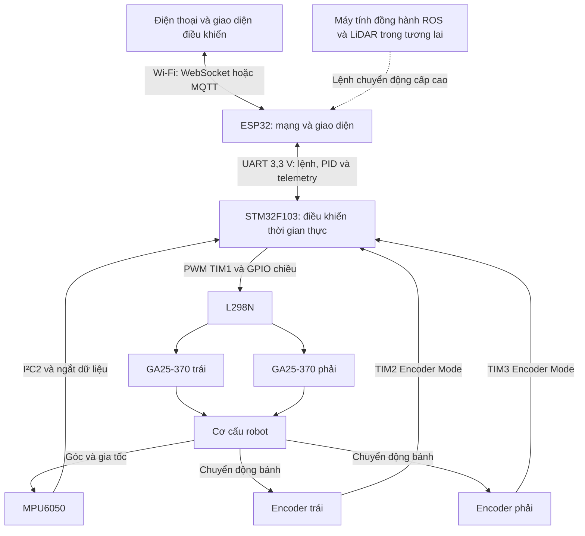
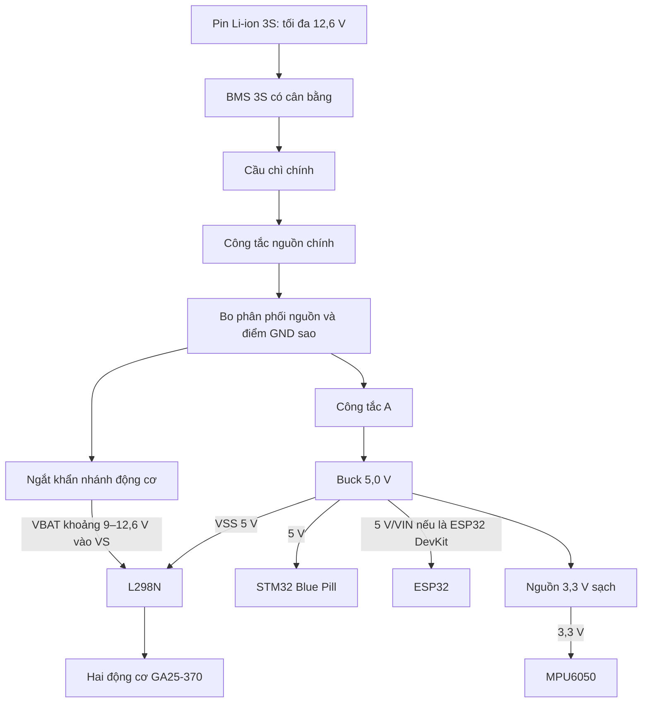
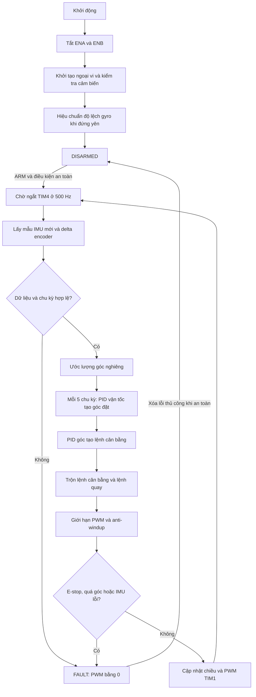

# NGHIÊN CỨU, THIẾT KẾ VÀ CHẾ TẠO ROBOT HAI BÁNH TỰ CÂN BẰNG TÍCH HỢP ĐIỀU KHIỂN KHÔNG DÂY

## 1. Giới thiệu

Đề tài tập trung nghiên cứu và chế tạo robot hai bánh tự cân bằng theo mô hình con lắc ngược hai bánh (Two-Wheeled Inverted Pendulum — TWIP). Đây là hệ phi tuyến, không ổn định và có liên kết chặt giữa góc nghiêng, vận tốc bánh xe và vị trí thân robot.

Hệ thống hiện tại sử dụng STM32F103C8T6 để thực hiện vòng điều khiển thời gian thực, ESP32 để giao tiếp không dây, MPU6050 để đo chuyển động và hai động cơ DC GA25-370 có encoder để tạo lực cân bằng. Robot được định hướng làm nền tảng cho đồ án tốt nghiệp và có thể mở rộng với ROS, LiDAR, SLAM và điều hướng tự hành trong giai đoạn sau.

> [!WARNING]
> Đây là hệ thống thử nghiệm dùng pin Li-ion 3S và động cơ có dòng khởi động lớn. Không nối hoặc tháo dây khi hệ thống đang có điện. Không dùng màu dây làm căn cứ duy nhất để xác định cực tính; luôn kiểm tra bằng đồng hồ đo trước khi cấp nguồn.

## 2. Mục tiêu đề tài

- Chế tạo mô hình robot hai bánh tự cân bằng sử dụng hai động cơ DC GA25-370 12 V, 280 RPM có encoder.
- Đọc dữ liệu gia tốc và vận tốc góc từ MPU6050, sau đó ước lượng góc nghiêng theo thời gian thực.
- Xây dựng bộ điều khiển cascade:
  - Vòng trong điều khiển góc cân bằng.
  - Vòng ngoài điều khiển vận tốc từ phản hồi encoder.
  - Thành phần vi sai trái–phải để điều khiển hướng quay.
- Điều khiển chuyển động và tinh chỉnh tham số PID từ điện thoại qua Wi-Fi.
- Tách tác vụ điều khiển thời gian thực trên STM32 khỏi tác vụ mạng không xác định thời gian trên ESP32.
- Xây dựng nền tảng có khả năng mở rộng với máy tính đồng hành chạy ROS và cảm biến LiDAR.

## 3. Cấu hình phần cứng hiện tại

| Khối | Linh kiện | Số lượng | Chức năng và ghi chú |
|---|---|---:|---|
| Điều khiển chính | STM32F103C8T6 Blue Pill | 1 | Đọc IMU và encoder, ước lượng trạng thái, chạy PID, xuất PWM và tín hiệu chiều |
| Kết nối không dây | ESP32 | 1 | Wi-Fi, WebSocket/MQTT hoặc Web Server; trao đổi dữ liệu với STM32 qua UART 3,3 V |
| Cảm biến quán tính | MPU6050 | 1 | Gia tốc kế và con quay hồi chuyển 6 trục; giao tiếp I²C |
| Động cơ | GA25-370 12 V, 280 RPM, có encoder | 2 | Động cơ DC chổi than, bánh trái và bánh phải |
| Driver động cơ | L298N hai cầu H | 1 | Điều khiển hai động cơ; phải kiểm tra dòng kẹt và nhiệt độ trước khi vận hành tải thực |
| Pin | Ba cell 18650 mắc nối tiếp | 1 bộ | Pin Li-ion 3S: khoảng 11,1 V danh định và 12,6 V khi sạc đầy |
| Bảo vệ pin | BMS 3S có cân bằng | 1 | Bảo vệ quá sạc, quá xả và quá dòng; BMS không thay thế cầu chì |
| Hạ áp | Buck có màn hình hiển thị | 1 | Dự kiến đặt đầu ra 5,0 V; dòng liên tục thực tế chưa được xác nhận |
| Đóng cắt | Công tắc nguồn chính | 1 | Ngắt nguồn pin khỏi toàn hệ thống, phải có định mức DC phù hợp |
| Cho phép điều khiển | Công tắc A | 1 | Chỉ cho phép cấp nguồn buck tới STM32, ESP32, MPU6050 và logic L298N khi bật |

Các linh kiện bảo vệ, lọc nguồn và đầu nối bổ sung được liệt kê tại [Mục 10](#10-các-linh-kiện-phụ-trợ-cần-bổ-sung).

## 4. Kiến trúc hệ thống

### 4.1. Luồng tín hiệu



STM32 là bộ điều khiển thời gian thực và phải tiếp tục giữ cân bằng khi ESP32 mất Wi-Fi hoặc khởi động lại. ESP32 chỉ cung cấp giá trị đặt chuyển động, tham số cấu hình và đường truyền telemetry; điện thoại không tham gia trực tiếp vào vòng phản hồi cân bằng.

### 4.2. Phân phối nguồn



Yêu cầu bắt buộc đối với khối nguồn:

- Không cấp trực tiếp 12,6 V vào chân `5V`, `3V3` hoặc GPIO của STM32/ESP32.
- Nếu cấp `VSS` 5 V cho L298N từ buck, phải tháo jumper `5V_EN` trên module nếu jumper này đang bật bộ ổn áp tích hợp. Không nối song song hai nguồn 5 V.
- Tất cả GND phải nối chung tại điểm sao trên bo phân phối nguồn, nhưng đường hồi dòng động cơ phải tách khỏi đường GND của MPU6050 và vi điều khiển.
- Nếu công tắc A chỉ cắt nguồn buck trong khi nhánh công suất L298N vẫn có điện, phải kéo `ENA` và `ENB` xuống GND bằng điện trở để driver mặc định ở trạng thái tắt.
- Nút dừng khẩn nên cắt vật lý nhánh cấp công suất cho động cơ và đồng thời gửi tín hiệu trạng thái về STM32.

## 5. Phân công chức năng

### 5.1. STM32F103C8T6

- Đọc MPU6050 qua I²C.
- Đọc hai encoder cầu phương bằng TIM2 và TIM3 ở Encoder Interface Mode.
- Ước lượng góc nghiêng bằng Complementary Filter; Kalman Filter là hướng nâng cấp sau khi hệ thống cơ bản hoạt động ổn định.
- Chạy vòng điều khiển góc dự kiến ở 500 Hz.
- Chạy vòng điều khiển vận tốc dự kiến ở 100 Hz.
- Xuất hai kênh PWM và bốn tín hiệu điều khiển chiều cho L298N.
- Kiểm tra mất dữ liệu IMU, quá góc, quá thời gian xử lý, điện áp pin thấp và tín hiệu dừng khẩn.
- Gửi telemetry và nhận lệnh/PID từ ESP32 qua UART.

### 5.2. ESP32

- Tạo giao diện Web hoặc kết nối ứng dụng điện thoại.
- Nhận lệnh tiến, lùi, quay trái, quay phải, dừng và ARM/DISARM.
- Nhận tham số PID từ giao diện, kiểm tra sơ bộ và đóng gói gửi sang STM32.
- Nhận góc, tốc độ, PWM, điện áp pin và trạng thái lỗi từ STM32.
- Không thực hiện vòng PID cân bằng và không được điều khiển trực tiếp L298N.

### 5.3. Giao thức STM32–ESP32

Kết nối UART dùng mức logic 3,3 V:

- `STM32 TX` nối `ESP32 RX`.
- `STM32 RX` nối `ESP32 TX`.
- Hai bo phải dùng chung GND.

Khung dữ liệu dự kiến:

```text
SOF | Version | Type | Sequence | Length | Payload | CRC-16
```

Gói cấu hình quan trọng cần có phản hồi `ACK/NACK`. STM32 kiểm tra giới hạn tham số trước khi áp dụng và chỉ lưu PID vào Flash khi nhận lệnh `COMMIT` riêng, tránh ghi Flash liên tục khi người dùng kéo thanh trượt trên giao diện.

## 6. Cấu trúc điều khiển



Vòng điều khiển cascade dự kiến:

\[
v \approx \frac{r}{2}\left(\omega_L+\omega_R\right)
\]

\[
\theta_{ref}=\operatorname{sat}\left(PID_v(v_{ref}-v),-\theta_{max},+\theta_{max}\right)
\]

\[
u_b=PID_\theta(\theta_{ref}-\theta)
\]

\[
u_L=u_b-u_y,\qquad u_R=u_b+u_y
\]

Dấu của góc, encoder và lệnh động cơ phải được kiểm tra khi nâng bánh khỏi mặt đất. Không được mặc định chiều dương chỉ dựa trên màu dây hoặc vị trí đầu nối.

## 7. Phân bổ chân STM32 dự kiến

| Chức năng | Chân STM32 | Ngoại vi | Kết nối ngoài |
|---|---|---|---|
| Encoder trái A | `PA0` | `TIM2_CH1` | Encoder L-A |
| Encoder trái B | `PA1` | `TIM2_CH2` | Encoder L-B |
| Encoder phải A | `PA6` | `TIM3_CH1` | Encoder R-A |
| Encoder phải B | `PA7` | `TIM3_CH2` | Encoder R-B |
| PWM động cơ trái | `PA8` | `TIM1_CH1` | L298N `ENA` |
| PWM động cơ phải | `PA11` | `TIM1_CH4` | L298N `ENB` |
| Chiều động cơ trái 1 | `PA4` | GPIO Output | L298N `IN1` |
| Chiều động cơ trái 2 | `PA5` | GPIO Output | L298N `IN2` |
| Chiều động cơ phải 1 | `PB0` | GPIO Output | L298N `IN3` |
| Chiều động cơ phải 2 | `PB1` | GPIO Output | L298N `IN4` |
| MPU6050 SCL | `PB10` | `I2C2_SCL` | MPU6050 `SCL` |
| MPU6050 SDA | `PB11` | `I2C2_SDA` | MPU6050 `SDA` |
| MPU6050 INT | `PA3` | `EXTI3` | MPU6050 `INT` |
| UART STM32 TX | `PA9` | `USART1_TX` | ESP32 RX |
| UART STM32 RX | `PA10` | `USART1_RX` | ESP32 TX |
| Đo điện áp pin | `PA2` | `ADC1_IN2` | Qua cầu chia áp và tụ lọc |
| Dừng khẩn logic | `PB12` | `TIM1_BKIN` hoặc GPIO | Tiếp điểm mức 3,3 V |
| Nạp/chẩn đoán | `PA13`, `PA14` | SWDIO, SWCLK | Đầu nạp ST-Link |
| Nhịp điều khiển | Không dùng chân ngoài | TIM4 Update IRQ | Dự kiến 500 Hz |

Không sử dụng `PA13`, `PA14`, `BOOT0` và `PB2/BOOT1` cho tín hiệu thông thường. Chân UART của ESP32 phải được xác định lại theo đúng phiên bản bo; `GPIO16/RX2` và `GPIO17/TX2` chỉ là lựa chọn thường dùng trên ESP32 DevKit cổ điển.

## 8. Bố trí cơ khí dự kiến

Robot sử dụng tổng cộng ba mặt sàn:

| Mặt sàn | Bố trí dự kiến | Yêu cầu chính |
|---|---|---|
| Tầng trệt | Khay pin 3S, BMS và công tắc nguồn chính | Đặt thấp, cân bằng trái–phải, chống rung và dễ tháo pin |
| Tầng 1 | L298N, buck, cầu chì, ngắt khẩn và bo phân phối nguồn | Dây dòng lớn ngắn; đủ khoảng thoáng làm mát; buck cách xa MPU6050 |
| Tầng 2 | STM32, MPU6050, ESP32 và các đầu nối tín hiệu | MPU6050 gần trục giữa; anten ESP32 không bị pin, kim loại hoặc dây nguồn che chắn |

Dây nguồn động cơ, dây logic, encoder, I²C và UART phải đi thành các bó riêng. Dây động cơ nên xoắn theo cặp và không đi song song sát dây MPU6050/I²C. Các dây xuyên tầng phải có chống kéo và không được cọ vào bánh xe, trục động cơ hoặc cạnh sắc.

## 9. Hạn chế kỹ thuật hiện tại

### 9.1. Driver L298N

L298N được giữ lại trong cấu hình hiện tại nhưng có các hạn chế:

- Cầu H dùng transistor lưỡng cực nên có sụt áp và tổn hao nhiệt lớn hơn driver MOSFET.
- Điện áp thực tế trên động cơ thấp hơn điện áp pin, đặc biệt khi tải nặng.
- Chưa thể kết luận driver an toàn với hai GA25-370 cho đến khi đo dòng khởi động và dòng kẹt từng động cơ.
- Phải thử nghiệm bằng nguồn có giới hạn dòng, giám sát nhiệt độ tản nhiệt và bắt đầu với giới hạn duty PWM thấp.

Nếu dòng kẹt vượt khả năng của L298N, phần mềm PID không thể sửa được giới hạn phần cứng. Trong phạm vi cấu hình này cần bổ sung cầu chì phù hợp, giới hạn duty/thời gian tăng tốc và cơ chế phát hiện bánh bị kẹt; không được thử kẹt kéo dài bằng pin 3S.

### 9.2. Mức logic encoder

Kiểu ngõ ra encoder chưa được xác nhận. Nếu encoder xuất push-pull 5 V thì không được nối trực tiếp vào STM32; cần mạch chuyển mức hoặc chia áp phù hợp. Nếu là open-collector, kéo lên 3,3 V tại phía STM32.

### 9.3. Nguồn logic

Dòng tối đa và đáp ứng quá độ của buck chưa được xác nhận. ESP32 có thể tạo xung dòng lớn khi phát Wi-Fi, vì vậy cần đo sụt áp rail 5 V/3,3 V và bổ sung tụ cục bộ trước khi chạy vòng điều khiển.

## 10. Các linh kiện phụ trợ cần bổ sung

- Cầu chì chính và cầu chì hoặc polyfuse cho từng nhánh phù hợp với dòng đo thực tế.
- Nút dừng khẩn có định mức DC phù hợp với dòng động cơ.
- Bo phân phối nguồn và terminal/jack khóa chống cắm ngược.
- Tụ điện phân dung lượng lớn gần đầu vào `VS` của L298N.
- Tụ gốm 100 nF lắp trực tiếp trên hai cực mỗi động cơ.
- Tụ decoupling 100 nF gần từng module logic và tụ bulk hỗ trợ ESP32.
- Điện trở kéo xuống `ENA`, `ENB` để driver mặc định tắt khi STM32 chưa khởi tạo.
- Điện trở kéo lên I²C nếu module MPU6050 chưa có sẵn; chỉ kéo lên 3,3 V.
- Cầu chia áp và tụ lọc cho kênh ADC đo pin 3S.
- Dây nguồn mềm nhiều lõi và đầu nối có dòng định mức cao hơn dòng hoạt động/khởi động thực tế.
- Đầu SWD, đầu UART và các jack encoder có khóa chống cắm ngược.
- Tấm chắn, giá đỡ hoặc cơ cấu giữ robot khi thử PID để hạn chế hư hỏng khi xe ngã.

Giá trị cầu chì, tiết diện dây và dòng định mức jack chỉ được chốt sau khi đo dòng kẹt của động cơ.

## 11. Kế hoạch triển khai

### Giai đoạn 1 — Xây dựng nền tảng cân bằng

1. Hoàn thiện sơ đồ nguồn, bảo vệ và phân phối GND.
2. Kiểm tra riêng rail pin, 5 V và 3,3 V khi chưa nối động cơ.
3. Đọc và hiệu chuẩn MPU6050; kiểm tra chiều dương của góc.
4. Đọc từng encoder bằng Encoder Mode; kiểm tra chiều và số xung.
5. Kiểm tra L298N và từng động cơ khi bánh được nâng khỏi mặt đất.
6. Đóng vòng điều khiển góc với giới hạn PWM bảo thủ.
7. Bổ sung vòng vận tốc và điều khiển quay.
8. Hoàn thiện UART STM32–ESP32, CRC, timeout và telemetry.
9. Xây dựng giao diện không dây để điều khiển và tinh chỉnh PID.
10. Đánh giá độ ổn định, thời gian đáp ứng, sai số xác lập và khả năng chống nhiễu tải.

### Giai đoạn 2 — Mở rộng đồ án tốt nghiệp

- Xây dựng mô hình động lực học và nhận dạng tham số hệ thống.
- So sánh PID cascade với LQR hoặc các phương pháp điều khiển phù hợp khác.
- Tích hợp máy tính đồng hành chạy ROS/ROS 2.
- Tích hợp LiDAR như RPLIDAR A1/A2 hoặc cảm biến khoảng cách phù hợp.
- Thực hiện odometry, SLAM, định vị và lập kế hoạch đường đi.
- Phát triển chức năng tránh vật cản và bám mục tiêu.

Máy tính đồng hành chỉ gửi giá trị đặt chuyển động cấp cao. Vòng cân bằng vẫn phải chạy cục bộ trên STM32 để giữ tính quyết định và an toàn khi ROS hoặc mạng gặp lỗi.

## 12. Thông số cần đo hoặc xác nhận

Trước khi chốt sơ đồ điện và chế tạo bộ dây, cần cung cấp:

- Phiên bản chính xác của bo ESP32.
- Phiên bản/module MPU6050 và sơ đồ các điện trở kéo lên có sẵn.
- Model, điện áp vào, dòng liên tục và dòng đỉnh của buck.
- Điện áp đầu ra buck dự kiến, mặc định thiết kế hiện tại là 5,0 V.
- Dòng không tải, dòng làm việc và dòng kẹt của từng GA25-370.
- Điện áp nguồn, kiểu đầu ra và số xung trên vòng của encoder.
- Dòng liên tục và dòng cắt của BMS 3S.
- Dòng định mức DC của công tắc nguồn, công tắc A và nút dừng khẩn.
- Kích thước ba mặt sàn, khoảng cách giữa các tầng, đường kính bánh xe và khối lượng robot.
- Các tụ lọc, diode bảo vệ và điện trở kéo lên/kéo xuống đã có sẵn trên từng module.

## 13. Nguyên tắc an toàn

- Chỉ sạc bộ pin 3S bằng bộ sạc CC/CV dành riêng cho Li-ion 3S, điện áp kết thúc 12,6 V.
- Không sạc qua nguồn cấp phòng thí nghiệm nếu chưa có quy trình giám sát và giới hạn phù hợp.
- BMS không thay thế cầu chì và không bảo vệ khỏi mọi lỗi đấu dây.
- Không thử dòng kẹt kéo dài; phép đo phải ngắn, có giới hạn dòng và có phương tiện ngắt nguồn ngay lập tức.
- Luôn tắt nguồn chính và xác nhận điện áp bằng đồng hồ trước khi nối, tháo hoặc đổi jack.
- Thử chiều động cơ và dấu encoder khi robot được kê chắc, bánh không chạm đất.
- Khi bắt đầu chỉnh PID, sử dụng giá đỡ hoặc dây giữ để robot không lao ra ngoài hoặc làm hỏng pin và mạch.

---

Tài liệu này mô tả cấu hình dự kiến hiện tại, chưa phải sơ đồ sản xuất hoàn chỉnh. Các giá trị bảo vệ công suất chỉ được xác nhận sau khi hoàn tất phép đo động cơ, kiểm tra module nguồn và thử nhiệt L298N.
